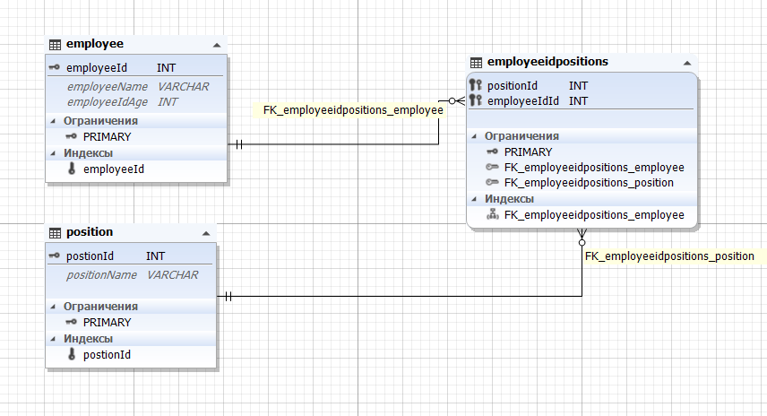
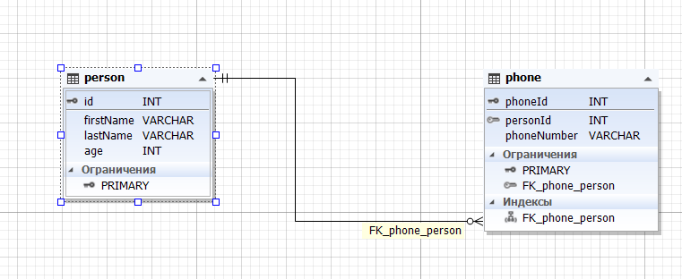
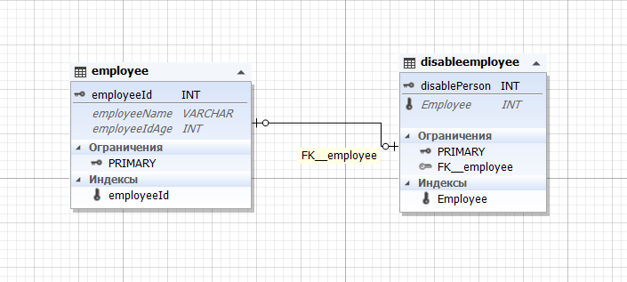

# Многие ко многим
Дання связь необходима когда каждая таблица из двух может ссылкаться на другую больше одного раза.
Для этой связи создается таблица посредник. В данной таблице происходит соединение с помощью  foreign key которые ссылаются на primary key или unique другой таблицы.

**Пример** Select

```sql
SELECT e.employeeName, e.employeeIdAge, p.positionName FROM employeeidpositions ep INNER JOIN employee e ON ep.employeeIdId = e.employeeId INNER JOIN position p ON ep.positionId = p.postionId;
```

**Создание таблиц**
```sql

DROP TABLE IF EXISTS `employee`;
CREATE TABLE IF NOT EXISTS `employee` (
  `employeeId` int(11) NOT NULL AUTO_INCREMENT,
  `employeeName` varchar(255) COLLATE utf8mb4_unicode_ci DEFAULT '',
  `employeeIdAge` int(11) DEFAULT '0',
  PRIMARY KEY (`employeeId`),
  UNIQUE KEY `employeeId` (`employeeId`)
) ENGINE=InnoDB AUTO_INCREMENT=4 DEFAULT CHARSET=utf8mb4 COLLATE=utf8mb4_unicode_ci;


DROP TABLE IF EXISTS `employeeidpositions`;
CREATE TABLE IF NOT EXISTS `employeeidpositions` (
  `positionId` int(11) NOT NULL,
  `employeeIdId` int(11) NOT NULL,
  PRIMARY KEY (`positionId`,`employeeIdId`),
  KEY `FK_employeeidpositions_employee` (`employeeIdId`),
  CONSTRAINT `FK_employeeidpositions_employee` FOREIGN KEY (`employeeIdId`) REFERENCES `employee` (`employeeId`),
  CONSTRAINT `FK_employeeidpositions_position` FOREIGN KEY (`positionId`) REFERENCES `position` (`postionId`)
) ENGINE=InnoDB DEFAULT CHARSET=utf8mb4 COLLATE=utf8mb4_unicode_ci;


DROP TABLE IF EXISTS `position`;
CREATE TABLE IF NOT EXISTS `position` (
  `postionId` int(11) NOT NULL AUTO_INCREMENT,
  `positionName` varchar(255) COLLATE utf8mb4_unicode_ci DEFAULT '',
  PRIMARY KEY (`postionId`),
  UNIQUE KEY `postionId` (`postionId`)
) ENGINE=InnoDB AUTO_INCREMENT=5 DEFAULT CHARSET=utf8mb4 COLLATE=utf8mb4_unicode_ci;

```



# Один ко многим
Первая таблица имеет одно значение, но у каждого значения может быть множество значений с другой таблицы. Для такого типа связы не надо создавать таблицу посредник.

**Пример** Select

```sql
SELECT ps.firstName, ps.lastName, ps.age, p.phoneNumber FROM phone p INNER JOIN person ps ON p.personId = ps.id;
```

**Создание таблиц**
```sql

DROP TABLE IF EXISTS `person`;
CREATE TABLE IF NOT EXISTS `person` (
  `id` int(11) NOT NULL AUTO_INCREMENT,
  `firstName` varchar(50) COLLATE utf8mb4_unicode_ci NOT NULL DEFAULT '0',
  `lastName` varchar(50) COLLATE utf8mb4_unicode_ci NOT NULL DEFAULT '0',
  `age` int(11) NOT NULL DEFAULT '0',
  PRIMARY KEY (`id`)
) ENGINE=InnoDB AUTO_INCREMENT=7 DEFAULT CHARSET=utf8mb4 COLLATE=utf8mb4_unicode_ci;

DROP TABLE IF EXISTS `phone`;
CREATE TABLE IF NOT EXISTS `phone` (
  `phoneId` int(11) NOT NULL AUTO_INCREMENT,
  `personId` int(11) NOT NULL DEFAULT '0',
  `phoneNumber` varchar(50) COLLATE utf8mb4_unicode_ci NOT NULL DEFAULT '0',
  PRIMARY KEY (`phoneId`),
  KEY `FK_phone_person` (`personId`),
  CONSTRAINT `FK_phone_person` FOREIGN KEY (`personId`) REFERENCES `person` (`id`)
) ENGINE=InnoDB AUTO_INCREMENT=4 DEFAULT CHARSET=utf8mb4 COLLATE=utf8mb4_unicode_ci;

```



# Один к одному

Схожа на связь один к многим но с тем отличием что каждое значение будет уникальным. По сути данная связь это разделение одной таблицы на несколько частей.

**Создание таблиц**
```sql

DROP TABLE IF EXISTS `employee`;

CREATE TABLE IF NOT EXISTS `employee` (
  `employeeId` int(11) NOT NULL AUTO_INCREMENT,
  `employeeName` varchar(255) COLLATE utf8mb4_unicode_ci DEFAULT '',
  `employeeIdAge` int(11) DEFAULT '0',
  PRIMARY KEY (`employeeId`),
  UNIQUE KEY `employeeId` (`employeeId`)
) ENGINE=InnoDB AUTO_INCREMENT=4 DEFAULT CHARSET=utf8mb4 COLLATE=utf8mb4_unicode_ci;

DROP TABLE IF EXISTS `disableemployee`;
CREATE TABLE IF NOT EXISTS `disableemployee` (
  `disablePerson` int(11) NOT NULL,
  `Employee` int(11) DEFAULT NULL,
  PRIMARY KEY (`disablePerson`),
  UNIQUE KEY `Employee` (`Employee`),
  CONSTRAINT `FK__employee` FOREIGN KEY (`Employee`) REFERENCES `employee` (`employeeId`)
) ENGINE=InnoDB DEFAULT CHARSET=utf8mb4 COLLATE=utf8mb4_unicode_ci;

```

